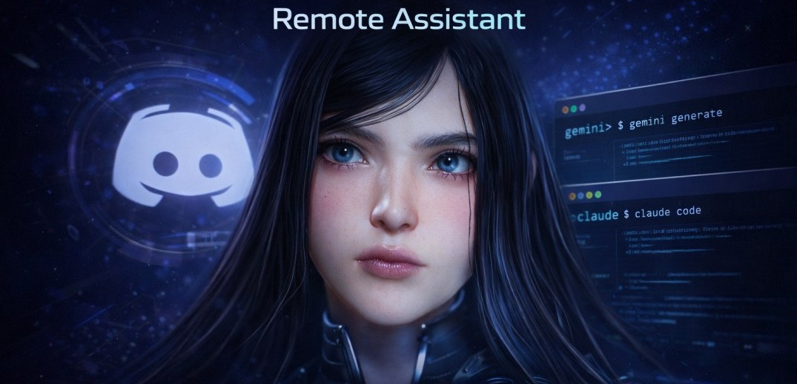

# Raven - Discord Remote PC Assistant

<p align="center">
  
</p>

This bot provides a bridge between Discord and high-performance AI command-line interfaces (CLIs), specifically **Gemini CLI** (v0.35.0) and **Claude Code**.

## Features
- **Default AI Chat**: Just type anything! Gemini handles any message that doesn't start with a prefix as a read-only prompt.
- `!gf <prompt>`: Full Gemini access (YOLO mode - can edit files/run commands).
- `!c <prompt>`: Interact with Claude Code CLI.
- `!g <prompt>`: Explicit Gemini prompt (Backward compatible).
- **Owner-Only Enforcement**: If `ALLOWED_USER_ID` is set, only that user can run AI commands, uploads, setup, and plain-message Gemini prompts.
- **Guided Onboarding**: `!setup` now supports `skip`, `cancel`, and retry-friendly validation prompts.
- **Context-Aware Help**: `!help` adapts to your state (first-time, configured, or restricted user) and suggests next actions.

<p align="center">
  
</p>
## 💡 Why Raven?
Raven is not just another chatbot. It is a **Remote PC Assistant** that gives you the power of elite AI agents directly on your local machine via Discord.

- **Direct File System Access**: Raven can read your code, write new files, and reorganize your project structure.
- **Command-Line Mastery**: It can install dependencies, run scripts, and execute shell commands autonomously.
- **Context-Aware Memory**: Using persistent CLI sessions, the AI remembers your project goals and previous actions.
- **Privacy & Security**: Each user works in their own isolated "Home" directory with built-in path sandboxing.
- **Dual-Action Modes**:
    - **Safe (Read-only)**: Default mode for analyzing code and answering questions without making changes.
    - **Powerful (YOLO)**: Full permission mode (`!gf`) to let the AI build and fix things for you.

## 🚀 Real-World Use Cases
- **Autonomous Coding**: *"Build a REST API using FastAPI and save it to `main.py`."*
- **Instant Debugging**: *"Read the error in my `app.log` and fix the bug in `utils.py`."*
- **System Automation**: *"Find all screenshots in my Downloads folder from today and move them to a `Project_Screenshots` folder."*
- **Environment Setup**: *"Initialize a new Node.js project, install `express` and `dotenv`, and create a basic `index.js`."*
- **Documentation**: *"Read all the `.py` files in this directory and generate a comprehensive `PROJECT_REPORT.md`."*
- **Remote Troubleshooting**: Fix issues on your home PC while away, using only your phone and Discord.

## 🔒 Private Bot Setup
Raven is designed to be a **private, local-first** assistant. Since it has full access to your file system and terminal, you should **never** let unauthorized users interact with it.

### 1. Create Your Discord Bot
1. Go to the [Discord Developer Portal](https://discord.com/developers/applications).
2. Click **New Application** and give it a name.
3. Under the **Bot** tab:
   - Enable **Message Content Intent** (Required).
   - Reset and copy your **Bot Token**.
4. Under the **OAuth2** tab:
   - Use the **URL Generator**.
   - Select `bot` scope and `Administrator` permissions (or specific permissions for message reading/sending).
   - Copy the generated URL and open it in your browser to invite the bot to your private server.

### 2. Secure the Bot
To ensure only you can control the bot, add your Discord User ID to the `.env` file:
- `ALLOWED_USER_ID=your_18_digit_id`
- `FULL_ACCESS=True` (Set to `False` if you want to restrict YOLO commands).
- `GEMINI_PATH=` (Optional override for Gemini executable path)
- `CLAUDE_PATH=` (Optional override for Claude executable or `cli.js` path)

When `FULL_ACCESS=True`, Ravenn keeps broad full-access behavior for Claude (`C:\` and `D:\`).
Use this mode only on a private, trusted server.

---

## 🛠️ Prerequisites
Before running the bot, you **must** have the following CLI agents installed and authenticated on your machine:

### 1. Gemini CLI
The core engine for the default chat and file management.
- **Install**: `npm install -g @google/gemini-cli`
- **Authenticate**: Run `gemini` in your terminal and follow the login prompts.
- **Documentation**: [Gemini CLI GitHub](https://github.com/google/gemini-cli)

### 2. Claude Code
Used for the `!c` command for specialized coding tasks.
- **Install**: `npm install -g @anthropic-ai/claude-code`
- **Authenticate**: Run `claude` in your terminal to complete the one-time setup.
- **Documentation**: [Claude Code Guide](https://docs.anthropic.com/claude/docs/claude-code)

---

## Setup
1. Clone this repository.
2. Rename `.env.example` to `.env` and fill in your credentials.
   - Optional path overrides:
     - `GEMINI_PATH=C:\path\to\gemini.cmd`
     - `CLAUDE_PATH=C:\path\to\claude.cmd` (or to `...\claude-code\cli.js`)
3. Install dependencies:
   ```bash
   pip install -r requirements.txt
   ```
4. Run the bot:
   ```bash
   python discord_bot.py
   ```

## 🏁 First-Time User Setup
Once the bot is running, you must initialize your environment in Discord:
1. Type **`!setup`** in any channel the bot can see.
2. Follow the interactive wizard to set your **Nickname** and **Project Path** (CWD).
3. (Optional) Provide additional directories you want Gemini to have access to.
4. During setup:
   - Type `skip` to keep an existing value.
   - Type `cancel` to exit without changing config.
5. Run `!status` to verify your active workspace.

<p align="center">
  
</p>

## 🎵 Music Integration (Spotify)
Ravenn includes a built-in Spotify controller. You can control your music via natural language (!gf) or direct commands.

<p align="center">
  
</p>

### Setup
1. Create an app on the [Spotify Developer Dashboard](https://developer.spotify.com/dashboard).
2. Add `http://127.0.0.1:8888/callback` to your **Redirect URIs** in the app settings.
3. Add your `SPOTIFY_CLIENT_ID` and `SPOTIFY_CLIENT_SECRET` to the `.env` file.
4. Run any music command once in your terminal (e.g., `python spotify_control.py status`) to complete the one-time OAuth handshake.

### Commands
- `!play [query]`: Search and play a track, artist, or album.
- `!pause`: Pause current playback.
- `!skip`: Skip to the next track.
- `!nowplaying`: Show current track details.
- `!gf play some lofi`: Use Gemini to search and play music for you.

## 🚀 Capabilities & Examples
Raven can handle complex, multi-step tasks autonomously. Here are some examples of what it can do:

<p align="center">
  
</p>

## 🚀 Running on Startup (Windows)
...

To have the bot start automatically when you log into your PC, you can use one of these methods:

### Method 1: The Startup Folder (Easiest)
1. Press `Win + R`, type `shell:startup`, and hit Enter.
2. Right-click the `start_bot.bat` file in your project folder and select **Create Shortcut**.
3. Drag that shortcut into the **Startup** folder you just opened.
4. Done! A console window will appear whenever you log in.

### Method 2: Task Scheduler (Stealth/Hidden)
1. Search for **Task Scheduler** in the Start menu and open it.
2. Click **Create Basic Task...** on the right.
3. Name it "Ravenn Bot" and set the Trigger to **When I log on**.
4. Set the Action to **Start a program**.
5. Browse and select your `start_bot.bat`.
6. In the **Start in (optional)** field, copy and paste the path to your project folder (e.g., `D:\Dev 2026\Fun\Ravenn`).
7. Finish. Now the bot will run in the background every time you log in.

## Dependencies
- `discord.py`
- `python-dotenv`
- `spotipy`
- Gemini CLI and Claude CLI must be installed and in your PATH.
